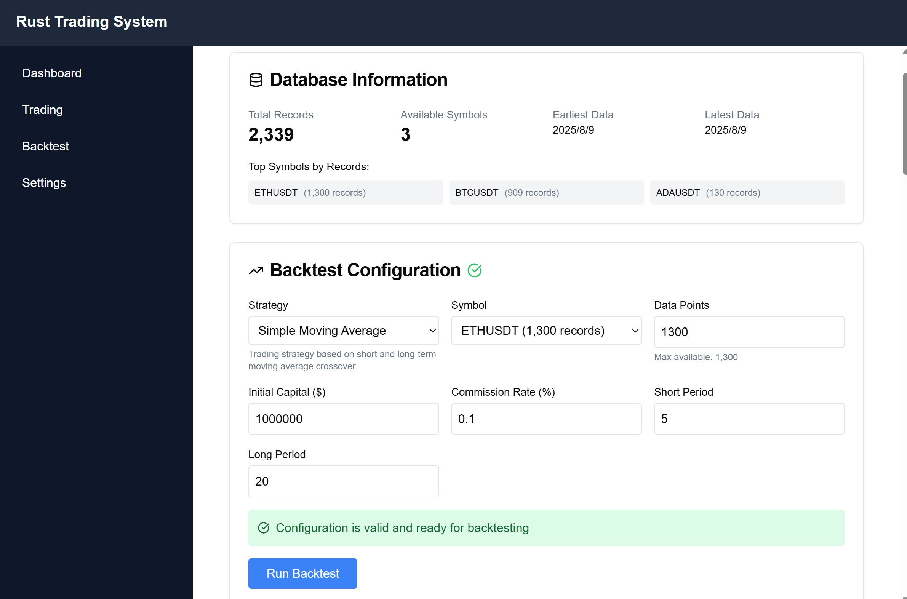
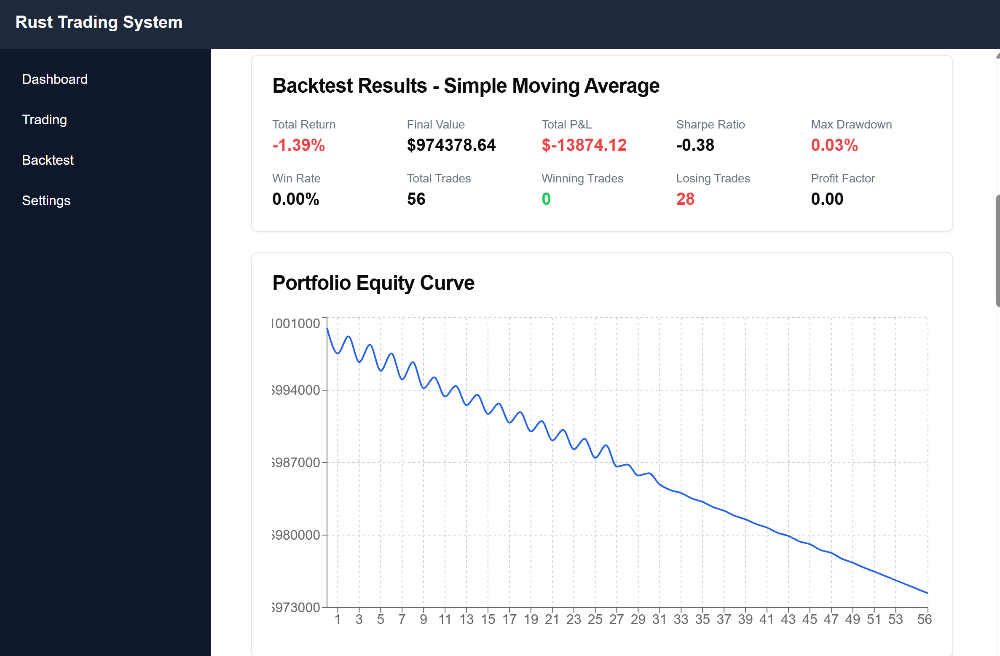
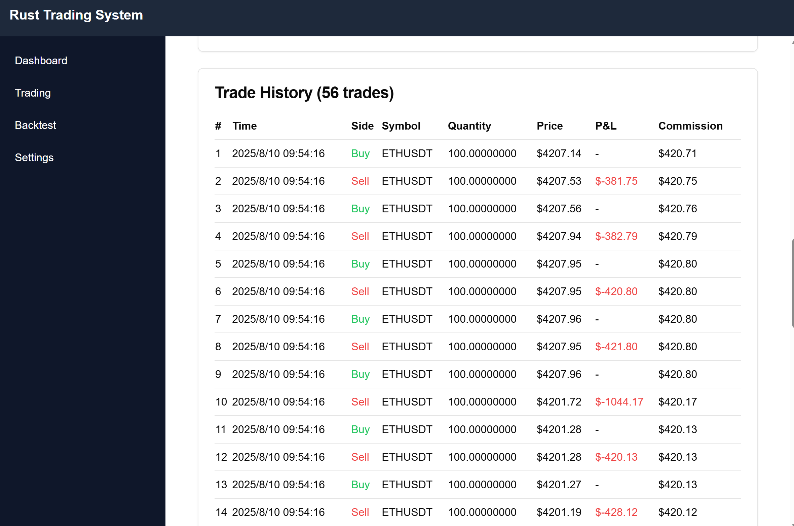

# Rust Trade

A comprehensive cryptocurrency trading system with real-time data collection, advanced backtesting capabilities, and a professional desktop interface.

[](https://www.rust-lang.org/)
[](LICENSE)
[](https://tauri.app/)

## 🎯 Overview

Rust Trade combines high-performance market data processing with sophisticated backtesting tools, delivering a complete solution for cryptocurrency quantitative trading. The system features real-time data collection from exchanges, a powerful backtesting engine with multiple strategies, and an intuitive desktop interface.

## 🏗️ Architecture

### **Live Data Collection Mode**
```
┌─────────────────┐    ┌─────────────────┐    ┌─────────────────┐
│   Exchange      │───▶│    Service      │───▶│   Repository    │
│   (WebSocket)   │    │  (Processing)   │    │   (Storage)     │
└─────────────────┘    └─────────────────┘    └─────────────────┘
         │                       │                       │
         │                       ▼                       ▼
    Binance API           ┌─────────────┐         ┌─────────────┐
    - Real-time data      │ Multi-Level │         │ PostgreSQL  │
    - Paper trading       │    Cache    │         │ Database    │
                          │ (L1 + L2)   │         │             │
                          └─────────────┘         └─────────────┘
                                    │
                                    ▼
                          ┌─────────────────┐
                          │ Paper Trading   │
                          │    Engine       │
                          └─────────────────┘
```

### **Desktop Application Mode**
```
┌─────────────────┐    ┌─────────────────┐    ┌─────────────────┐
│   Next.js       │───▶│  Tauri Commands │───▶│ Trading Common  │
│   Frontend      │    │   (src-tauri)   │    │    (Library)    │
└─────────────────┘    └─────────────────┘    └─────────────────┘
                                                       │
                               ┌───────────────────────┴───────────────────────┐
                               ▼                                               ▼
                       ┌─────────────────┐                             ┌─────────────────┐
                       │ Backtest Engine │                             │   Repository    │
                       │  + Strategies   │                             │   + Database    │
                       └─────────────────┘                             └─────────────────┘
```

## 📁 Project Structure
```
rust-trade/
├── assets/                # Project assets and screenshots
├── config/                # Global configuration files
│   ├── development.toml   # Development environment config
│   ├── production.toml    # Production environment config
│   ├── schema.sql         # PostgreSQL table definitions
│   └── test.toml          # Test environment config
├── frontend/              # Next.js frontend application
│   ├── src/               # Frontend source code
│   │   ├── app/           # App router pages
│   │   │   ├── page.tsx   # Dashboard homepage
│   │   │   └── backtest/  # Backtesting interface
│   │   ├── components/    # Reusable UI components
│   │   │   ├── layout/    # Layout components
│   │   │   └── ui/        # shadcn/ui components
│   │   └── types/         # TypeScript type definitions
│   ├── tailwind.config.js # Tailwind CSS configuration
│   └── package.json       # Frontend dependencies
├── src-tauri/             # Desktop application backend
│   ├── src/               # Tauri command handlers and state management
│   │   ├── commands.rs    # Tauri command implementations
│   │   ├── main.rs        # Application entry point
│   │   ├── state.rs       # Application state management
│   │   └── types.rs       # Frontend interface types
│   ├── Cargo.toml         # Tauri dependencies (uses trading-common)
│   └── tauri.conf.json    # Tauri configuration
├── trading-common/        # Shared library for all crates
│   ├── src/
│   │   ├── backtest/      # Backtesting engine and strategies
│   │   │   ├── engine.rs  # Core backtesting logic
│   │   │   ├── metrics.rs # Performance calculations
│   │   │   ├── portfolio.rs # Portfolio management
│   │   │   └── strategy/  # Trading strategies (RSI, SMA)
│   │   ├── data/          # Data layer
│   │   │   ├── cache.rs   # Multi-level caching system
│   │   │   ├── repository.rs # Database operations
│   │   │   └── types.rs   # Core data structures
│   │   └── lib.rs         # Library entry point
│   └── Cargo.toml         # Common dependencies
├── trading-core/          # CLI trading system
│   ├── src/
│   │   ├── exchange/      # Exchange integrations
│   │   │   └── binance.rs # Binance WebSocket client
│   │   ├── live_trading/  # Paper trading system
│   │   │   └── paper_trading.rs # Real-time strategy execution
│   │   ├── service/       # Business logic layer
│   │   │   └── market_data.rs # Data processing service
│   │   ├── config.rs      # Configuration management
│   │   ├── lib.rs         # Library entry point (re-exports trading-common)
│   │   └── main.rs        # CLI application entry point
│   ├── benches/           # Performance benchmarks
│   ├── Cargo.toml         # Core dependencies
│   └── README.md          # Core system documentation
└── README.md              # This file
```

## 🚀 Quick Start

### Prerequisites

- **Rust 1.70+** - [Install Rust](https://rustup.rs/)
- **Node.js 18+** - [Install Node.js](https://nodejs.org/)
- **Docker** - [Install Docker](https://docs.docker.com/get-docker/)

### 1. Clone the Repository

```bash
git clone https://github.com/Erio-Harrison/rust-trade.git
cd rust-trade
```

### 2. Start Infrastructure

```bash
docker compose up -d
```

This starts PostgreSQL (port 5432) and Redis (port 6379). Database tables are created automatically on first launch.

### 3. Environment Configuration

Copy `.env.example` to `.env` in the root directory and in `trading-core/`:

```bash
cp .env.example .env
cp .env.example trading-core/.env
```

### 4. Install Dependencies

```bash
# Install frontend dependencies
cd frontend && npm install && cd ..
```

## 🎮 Running the Application

### Option 1: Desktop Application (Recommended)

```bash
# Development mode with hot reload
cd frontend && npm run tauri dev
# or alternatively
cd frontend && cargo tauri dev

# Production build
cd frontend && npm run tauri build
# or alternatively
cd frontend && cargo tauri build
```

### Option 2: Core Trading System (CLI)

```bash
cd trading-core

# Start live data collection
cargo run live

# Start live data collection with paper trading
cargo run live --paper-trading

# Run backtesting interface
cargo run backtest

# Show help
cargo run -- --help
```

### Option 3: Web Interface Only

```bash
cd frontend

# Development server
npm run dev

# Production build
npm run build
npm start
```

## 📊 Features

### **Live Data Collection**
- Real-time WebSocket connections to cryptocurrency exchanges
- High-performance data processing (~390µs single insert, ~13ms batch)
- Multi-level caching with Redis and in-memory storage
- Automatic retry mechanisms and error handling

### **Advanced Backtesting**
- Multiple trading strategies (SMA, RSI)
- Professional performance metrics (Sharpe ratio, drawdown, win rate)
- Portfolio management with P&L tracking
- Interactive parameter configuration

### **Desktop Interface**
- Real-time data visualization
- Intuitive strategy configuration
- Comprehensive result analysis
- Cross-platform support (Windows, macOS, Linux)

## 🖼️ Screenshots

### Backtest Configuration


### Results Dashboard


### Trade Analysis


## ⚙️ Configuration

### Trading Symbols

Edit `config/development.toml`:

```toml
# Trading pairs to monitor
symbols = ["BTCUSDT", "ETHUSDT", "ADAUSDT"]

[server]
host = "0.0.0.0"
port = 8080

[database]
max_connections = 5
min_connections = 1
max_lifetime = 1800

[cache]
[cache.memory]
max_ticks_per_symbol = 1000
ttl_seconds = 300

[cache.redis]
pool_size = 10
ttl_seconds = 3600
max_ticks_per_symbol = 10000
```

### Logging

Set log levels via environment variables:

```bash
# Application logs
RUST_LOG=trading_core=info

# Debug mode
RUST_LOG=trading_core=debug,sqlx=info
```

## 📈 Performance

Based on comprehensive benchmarks:

| Operation | Performance | Use Case |
|-----------|-------------|----------|
| Single tick insert | ~390µs | Real-time data |
| Batch insert (100) | ~13ms | Bulk processing |
| Cache hit | ~10µs | Data retrieval |
| Historical query | ~450µs | Backtesting |

## 🔧 Development

### Running Tests

```bash
# Core system tests
cd trading-core
cargo test

# Benchmarks
cargo bench

# Frontend tests
cd frontend
npm test
```

### Building for Production

```bash
# Build trading core
cd trading-core
cargo build --release

# Build desktop app
cd ../frontend
npm run tauri build

# Build web interface
npm run build
```

## 📚 Documentation

- **Trading Core**: See `trading-core/README.md` for detailed backend documentation
- **Desktop App**: See `src-tauri/README.md` for Tauri application details

## 🤝 Contributing

1. Fork the repository
2. Create your feature branch (`git checkout -b feature/amazing-feature`)
3. Commit your changes (`git commit -m 'Add amazing feature'`)
4. Push to the branch (`git push origin feature/amazing-feature`)
5. Open a Pull Request

## 📄 License

This project is licensed under the MIT License - see the [LICENSE](LICENSE) file for details.

## 👨‍💻 Author

**Erio Harrison** - [GitHub](https://github.com/Erio-Harrison)


---

Built with ❤️ using Rust, Tauri, and Next.js